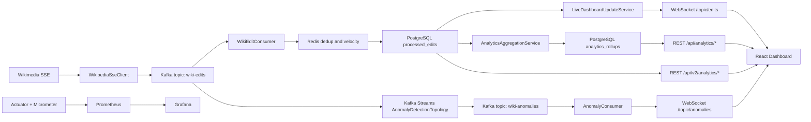
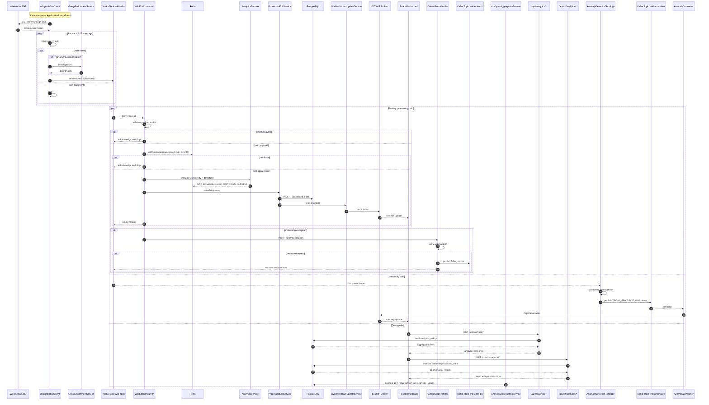

# WikiPulse Architecture

## 1. Purpose and Scope

This document is the implementation-accurate architecture blueprint for WikiPulse.

It intentionally presents the system as a practical exploration of streaming behavior under simulated load, with explicit trade-offs and limits, rather than as an absolute reliability claim.

Reliability language in this document uses loss-minimized, at-least-once processing semantics.

## 2. System Context and Boundaries

WikiPulse has three active runtime paths:

1. Command path (durability-first)
   - Wikimedia SSE -> Spring WebFlux ingest -> Kafka topic `wiki-edits` -> worker consumer group -> Redis state checks -> PostgreSQL persistence -> WebSocket push
2. Query path (analytics-first, PostgreSQL-backed)
   - PostgreSQL `analytics_rollups` serves `/api/analytics/*`
   - PostgreSQL `processed_edits` (with targeted indexes) serves `/api/v2/analytics/*`
3. Live UX path
   - STOMP/SockJS streams `/topic/edits` and `/topic/anomalies` feed the React Dashboard

The architecture keeps Kafka as the durable event buffer and replay substrate, with PostgreSQL as the active store for both OLTP and analytics read APIs.

## 3. Runtime Topology

Core runtime components:

1. Spring Boot ingestor/worker service
2. Kafka + ZooKeeper
3. Redis
4. PostgreSQL
5. React Dashboard served by Nginx
6. Prometheus + Grafana

Frontend routing:

1. `/api/` proxied to `http://wikipulse-worker:8080/api/`
2. `/ws-wikipulse` proxied to `http://wikipulse-worker:8080`

This keeps browser traffic same-origin while forwarding APIs and WebSocket handshakes to the worker service.

## 4. End-to-End Event Flow

### 4.1 Ingestion and normalization

1. `WikipediaSseClient` starts on `ApplicationReadyEvent`.
2. WebFlux client subscribes to Wikimedia `recentchange` SSE.
3. Non-edit messages are filtered.
4. Edit payloads are mapped into `WikiEditEvent`.
5. Anonymous actor patterns trigger GeoIP enrichment.
6. Reactor backpressure buffer protects burst periods.
7. Records publish to Kafka topic `wiki-edits` keyed by page title.

### 4.2 Save-before-ack consumer contract

`WikiEditConsumer` executes:

1. validate payload
2. deduplicate (`DeduplicationService`)
3. enrich (`AnalyticsService` complexity + velocity-based bot heuristic)
4. persist (`ProcessedEditService` -> PostgreSQL)
5. broadcast (`LiveDashboardUpdateService` -> `/topic/edits`)
6. acknowledge offset

Contract ordering:

`Read -> Deduplicate -> Enrich -> Persist -> Publish -> Acknowledge`

### 4.3 Failure handling and quarantine

1. Listener exceptions route through `DefaultErrorHandler`.
2. Failed records retry with bounded backoff.
3. Terminal failures route to `wiki-edits-dlt` via `DeadLetterPublishingRecoverer`.

This isolates poison payloads without freezing partition progress.

### 4.4 Parallel anomaly stream

`AnomalyDetectionTopology` reads `wiki-edits` in parallel and emits `wiki-anomalies` based on windowed thresholds:

1. `TREND_SPIKE` threshold: 20 edits
2. `EDIT_WAR` threshold: 5 revert edits
3. Window size: 60 seconds

`AnomalyConsumer` forwards alerts to `/topic/anomalies` for UI display.

## 5. System Architecture Diagram (Mermaid)

## 6. System Sequence Diagram (Mermaid)

## 7. Canonical Event and DTO Contracts

### 7.1 Kafka event: `WikiEditEvent`

Primary fields used through pipeline:

1. `id`, `title`, `user`, `timestamp`, `type`
2. `bot`, `comment`, `serverUrl`, `namespace`
3. `country`, `city`, `byteDiff`, `isRevert`, `isAnonymous`
4. `meta` (`domain`, `stream`, `uri`, `dt`)

### 7.2 UI DTOs

1. `/topic/edits` -> `EditUpdateDto`
2. `/topic/anomalies` -> anomaly payloads
3. `/api/v2/analytics/geo` -> `GeoCountDto`
4. `/api/v2/analytics/behavior` -> `EditBehaviorDto`

## 8. Persistence and Cache Design

## 8.1 PostgreSQL table: `processed_edits`

Role:

1. authoritative persisted event log for command path
2. direct read source for `/api/v2/analytics/*`

Important indexing strategy from entity mapping:

1. `idx_edit_timestamp`
2. `idx_is_bot_timestamp` (`is_bot`, `edit_timestamp`)
3. `idx_server_url_timestamp` (`server_url`, `edit_timestamp`)
4. `idx_country_timestamp` (`country`, `edit_timestamp`)
5. existing operational indexes (`idx_user_timestamp`, `idx_page_title`, `idx_server_url`)

These indexes are the main reason PostgreSQL can serve both write-heavy ingestion and filtered analytical reads.

## 8.2 PostgreSQL table: `analytics_rollups`

Role:

1. pre-aggregated buckets for dashboard endpoints under `/api/analytics/*`
2. materialized-view style summary storage with refresh job cadence

Refresh behavior:

1. `AnalyticsAggregationService` runs every 10 minutes
2. reads recent `processed_edits`
3. normalizes language/namespace
4. upserts grouped counts into `analytics_rollups`

## 8.3 Redis state model

Dedup key:

1. `edit:processed:<id>`
2. atomic `setIfAbsent`
3. TTL: 24 hours

Velocity key:

1. `bot:velocity:<user>`
2. `INCR` on each event
3. `EXPIRE 60s` when counter is first created

## 9. Frontend and API Serving Strategy

React Dashboard has two major UX tracks:

1. Analytics overview (polling REST endpoints)
2. Live firehose (WebSocket updates + bounded in-memory list)

Hydration pattern:

1. initial REST fetch from `/api/edits/recent`
2. WebSocket attach to `/topic/edits` and `/topic/anomalies`
3. list caps enforce bounded memory usage

## 10. Reliability and Scaling Characteristics

1. At-least-once delivery semantics with manual acknowledgments
2. Replay tolerance through Kafka durability and dedup fences
3. Poison payload isolation through retry + DLT
4. Kafka partitioning enables horizontal worker scaling
5. HPA demonstrates consumer scaling behavior under synthetic load

## 11. Trade-offs and Accepted Limitations

## 11.1 ClickHouse Amputation

Historical decision:

1. Earlier revisions used a ClickHouse read model for deep analytics isolation.
2. Current architecture removed that active dependency to reduce operational complexity and keep this iteration focused on streaming pipeline behavior.

Rationale:

1. The project goal shifted from maximal technology breadth to clearer analysis of ingestion pressure, consumer lag, and scaling behavior.
2. PostgreSQL plus targeted indexes and rollups is sufficient for the current experiment envelope.

## 11.2 Redis Dedup Compromise

Accepted compromise:

1. Dedup keys expire after 24 hours.

Risk accepted:

1. Replays that occur outside that TTL window can be treated as first-seen and reprocessed.

Mitigation already in place:

1. PostgreSQL primary key on event id still rejects duplicate inserts.
2. Duplicate side effects are limited by save-before-ack flow and database constraints.

## 11.3 Anomaly Detection Limitations

Current detection is intentionally heuristic:

1. fixed threshold windows for `TREND_SPIKE` and `EDIT_WAR`
2. no adaptive baseline, seasonality, or model-based confidence scoring

Trade-off accepted:

1. Fast and deterministic alerts are preferred over model complexity.
2. False positives and missed edge cases are possible by design.

## 12. Observability Stack

Application metrics include:

1. `wikipulse_edits_processed_total`
2. `wikipulse_bots_detected_total`
3. `wikipulse_errors_total`
4. `wikipulse_processing_latency`

Platform metrics include:

1. Kafka consumer lag exports
2. JVM/process/container metrics

Operational interpretation:

1. rising lag + latency indicates saturation or dependency pressure
2. rising error counters indicate malformed payload bursts or downstream instability

## 13. Verification Checklist

This document is aligned with:

1. worker code paths (`consumer`, `service`, `repository`, `api`, `topology`)
2. PostgreSQL entity mappings and indexes
3. frontend data flow (`api.ts`, `websocket.ts`, tabs)
4. Kubernetes and local deployment manifests

## 14. Key Operational Constants

1. SSE source: `https://stream.wikimedia.org/v2/stream/recentchange`
2. Input topic: `wiki-edits`
3. DLT topic: `wiki-edits-dlt`
4. Anomaly topic: `wiki-anomalies`
5. Dedup TTL: 24h
6. Velocity window TTL: 60s
7. Anomaly window: 60s
8. Trend spike threshold: 20
9. Edit war threshold: 5
10. Rollup refresh interval: 10 minutes

---

End of definitive blueprint.