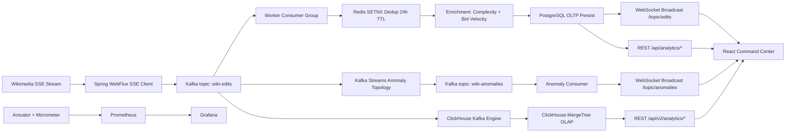

# WikiPulse V3: Zero-Data-Loss Event Streaming Platform

[](https://openjdk.org/)
[](https://spring.io/projects/spring-boot)
[](https://kafka.apache.org/)
[](https://kafka.apache.org/documentation/streams/)
[](https://www.postgresql.org/)
[](https://clickhouse.com/)
[](https://redis.io/)
[](https://react.dev/)
[](https://prometheus.io/)
[](https://grafana.com/)
[](https://kubernetes.io/)
[](https://docs.docker.com/compose/)

Traditional monolithic databases melt down when forced to do two conflicting jobs simultaneously: absorb unpredictable firehose writes and answer heavy analytical queries for dashboards.

WikiPulse V3 exists to solve that architecture trap.

This project is a highly available, zero-data-loss event streaming platform that enforces strict CQRS boundaries. Kafka absorbs burst pressure and guarantees replayability, PostgreSQL protects transactional durability, and ClickHouse handles sub-second OLAP aggregations without blocking the write path.

The goal is explicit and portfolio-grade: demonstrate enterprise system design, poison-pill resilience, elastic Kubernetes autoscaling, and real-time observability under true streaming load.

> 📹 **[Watch the full Architecture Walkthrough & Live K8s Scaling Demo here](INSERT_LINK_LATER)**

---

## Table of Contents

1. [Problem, Solution, and Why It Matters](#problem-solution-and-why-it-matters)
2. [System Architecture Deep Dive](#system-architecture-deep-dive)
3. [Technology Decisions and Rejected Alternatives](#technology-decisions-and-rejected-alternatives)
4. [Neo-Brutalist Command Center (Frontend)](#neo-brutalist-command-center-frontend)
5. [Observability Stack (Prometheus + Grafana)](#observability-stack-prometheus--grafana)
6. [Local Docker Fast-Start](#local-docker-fast-start)
7. [Kubernetes Elastic Scaling Walkthrough](#kubernetes-elastic-scaling-walkthrough)
8. [Testing Methodology and Quality Gates](#testing-methodology-and-quality-gates)
9. [Portfolio Highlights](#portfolio-highlights)
10. [Roadmap](#roadmap)

---

## Problem, Solution, and Why It Matters

### The Problem

Live event streams like Wikimedia `recentchange` are bursty by nature. Traffic surges can jump from calm to chaos in seconds. If a single datastore is responsible for both ingestion and analytics, several failures appear quickly:

1. Write-path saturation during spikes.
2. Contention between OLTP writes and OLAP `GROUP BY` scans.
3. Consumer deadlocks from poison-pill payloads.
4. Lag growth that remains invisible until user impact.

### The Solution

WikiPulse V3 separates concerns as a first-class architecture rule:

1. **Command Path**: SSE -> Kafka -> Worker -> PostgreSQL
2. **Query Path**: Kafka -> ClickHouse -> Analytics APIs -> Dashboard
3. **Live Operations Path**: Actuator/Micrometer -> Prometheus -> Grafana
4. **Real-Time UX Path**: STOMP/SockJS topics -> React live feed + anomaly ticker

### The Outcome

1. Bursty traffic is absorbed by Kafka backpressure and partitioned consumer scaling.
2. Analytics no longer compete with transactional durability.
3. Poison pills are quarantined to a dedicated DLT instead of stalling partitions.
4. Operators get a measurable control plane for lag, throughput, CPU, and memory.

---

## System Architecture Deep Dive

### End-to-End Flow

1. **Ingestion**
   1. `WikipediaSseClient` consumes Wikimedia SSE via Spring WebFlux.
   2. Events are normalized into `WikiEditEvent` and pushed to Kafka topic `wiki-edits`.
   3. Producer uses idempotence and asynchronous `whenComplete` callbacks for reliability visibility.

2. **Reliable Processing**
   1. `WikiEditConsumer` reads with `AckMode.MANUAL_IMMEDIATE`.
   2. Redis deduplication uses atomic `SETNX` semantics with a 24-hour TTL.
   3. Analytics enrichment computes complexity and bot velocity.
   4. `ProcessedEditService` persists to PostgreSQL before acknowledging Kafka offset.
   5. Persistence success triggers live dashboard WebSocket broadcast.

3. **Poison-Pill Resilience**
   1. `ErrorHandlingDeserializer` guards malformed payloads.
   2. `DefaultErrorHandler` retries with fixed backoff.
   3. Terminal failures route to `wiki-edits-dlt` (3 partitions) through `DeadLetterPublishingRecoverer`.

4. **Anomaly Detection (Kafka Streams CEP)**
   1. `AnomalyDetectionTopology` reads `wiki-edits` in parallel to the worker consumer path.
   2. 60-second tumbling windows (`TimeWindows.ofSizeWithNoGrace`) detect:
      1. `TREND_SPIKE` for high title edit velocity.
      2. `EDIT_WAR` for concentrated revert bursts.
   3. Alerts are written to `wiki-anomalies` and pushed to `/topic/anomalies` over WebSocket.

5. **CQRS Read Model**
   1. PostgreSQL remains OLTP source-of-truth for durable writes.
   2. ClickHouse consumes from Kafka using Kafka engine + materialized view.
   3. Deep analytics endpoints (`/api/v2/analytics/*`) query ClickHouse for OLAP isolation.

### Reliability Contract

The core ordering guarantee is:

**Read -> Deduplicate -> Enrich -> Persist -> Acknowledge**

This treats Kafka as a write-ahead log and preserves replay safety during crashes.

### Architecture Diagram



---

## Technology Decisions and Rejected Alternatives

This section reflects decisions captured in ADRs and workspace implementation.

### Java 21 + Spring Boot 3.4

**Why chosen**

1. Virtual threads (JEP 444) align with I/O-heavy stream handling.
2. Record-based DTO modeling improves immutability and schema clarity.
3. Spring ecosystem gives integrated support for Kafka, Redis, Actuator, WebSocket, and JPA.

**Why virtual threads over traditional thread pools**

1. Bursty I/O workloads make pool sizing brittle.
2. Virtual threads reduce risk of thread-pool starvation under reconnect or downstream latency.
3. Better concurrency headroom with simpler operational tuning.

**Rejected**

1. Platform-thread pool tuning as primary scaling strategy.
2. Rejected because it adds fragile queue/pool tuning constraints during unpredictable bursts.

### Apache Kafka + Kafka Streams

**Why Kafka over RabbitMQ**

1. WikiPulse needs retained, replayable event logs as a core operational primitive.
2. Partitioned ordering by key (`title`) is essential for per-entity causality.
3. Consumer-group rebalancing maps directly to horizontal scaling behavior.
4. Replayability supports failure recovery, auditing, and deterministic reprocessing.

RabbitMQ is strong for queue-first task dispatch, but the WikiPulse workload prioritizes stream retention and replay semantics over ephemeral queue consumption.

**Why Kafka Streams**

1. Native windowed CEP with low architecture overhead.
2. Deterministic 60-second tumbling windows for anomaly rules.
3. Keeps anomaly path decoupled from core persistence pipeline.

### ClickHouse vs PostgreSQL (Strict CQRS Split)

**Why ClickHouse was added**

1. PostgreSQL is optimized for durable OLTP writes and transactional consistency.
2. Analytical workloads (geo, behavior, high-cardinality aggregations) can degrade OLTP write latency.
3. ClickHouse columnar engine is designed for fast aggregations and wide scans.
4. CQRS split prevents dashboard read spikes from harming write-path durability.

**Role boundaries**

1. PostgreSQL: source of truth, worker persistence, websocket publication trigger.
2. ClickHouse: OLAP sink and deep analytics read model.

**Rejected**

1. Single PostgreSQL-only architecture for both write and heavy analytics.
2. Rejected due lock/contention and read amplification risk under dashboard load.

### Redis Dual Purpose

1. **Deduplication**: `SETNX` key `edit:processed:<id>` with 24-hour TTL.
2. **Bot velocity**: atomic `INCR` counter with 60-second TTL window.

**Why this matters**

1. Atomic distributed state avoids race conditions between parallel consumers.
2. O(1) counters avoid expensive relational counting for high-RPS velocity detection.

### Kubernetes HPA vs Docker Compose

**Why Minikube/K8s is required**

1. Docker Compose gives deterministic local orchestration but no true HPA control loop.
2. Kubernetes enables utilization-based scaling, probe-gated rollout safety, and scheduler realism.
3. This is mandatory for demonstrating physical autoscaling behavior in a portfolio context.

**Current HPA settings (from manifests)**

1. `minReplicas: 1`
2. `maxReplicas: 5`
3. CPU target `averageUtilization: 20`
4. Fast scale-up and conservative scale-down stabilization windows.

---

## Neo-Brutalist Command Center (Frontend)

The React UI is intentionally split into two operator modes:

1. **Analytics Overview Tab**
   1. Filtered KPI snapshots and chart suite.
   2. Shared filters for timeframe, bot status, and project scope.
   3. 10-second polling for synchronized refresh.
   4. Recharts visualization stack:
      1. Top language distribution.
      2. Bot vs human split.
      3. Namespace distribution.
      4. Time-series trend area chart.
   5. Live anomaly ticker from `/topic/anomalies`.

2. **Live Firehose Tab**
   1. Initial hydration from `/api/edits/recent`.
   2. Continuous STOMP/SockJS stream from `/topic/edits`.
   3. Rolling 100-item window to cap memory and render cost.
   4. Visual bot/human badges and event metadata.

### Design language

The dashboard uses a Neo-Brutalist system:

1. Hard borders, sharp shadows, high-contrast palette.
2. Monospace typography and deliberate status color coding.
3. Functional legibility over decorative minimalism.

---

## Observability Stack (Prometheus + Grafana)

### Telemetry Pipeline

1. Spring Actuator exports `/actuator/prometheus`.
2. Prometheus scrapes worker metrics and cAdvisor container telemetry.
3. Kafka consumer lag appears via Micrometer Kafka bindings.
4. Grafana dashboards surface throughput, lag, CPU, memory, and worker presence.

### Core metrics

1. `wikipulse_edits_processed_total`
2. `wikipulse_bots_detected_total`
3. `wikipulse_errors_total`
4. `wikipulse_processing_latency`
5. `kafka_consumer_fetch_manager_records_lag`
6. `process_cpu_usage`
7. `jvm_memory_used_bytes`
8. `container_last_seen`

### Example panel expressions

1. Throughput: `sum(rate(wikipulse_edits_processed_total[1m]))`
2. Total lag: `sum(kafka_consumer_fetch_manager_records_lag{job="wikipulse-worker"})`
3. Active workers (compose): `count(container_last_seen{container_label_com_docker_compose_service="wikipulse-worker"})`

### Deployment note

1. Docker Compose Grafana datasource points to `http://prometheus:9090`.
2. K8s datasource manifest points to `http://prometheus-service:9090` and expects a matching service in-cluster.

---

## Local Docker Fast-Start

### Prerequisites

1. Docker Desktop (Compose v2).
2. Recommended minimum 8 GB RAM.
3. Available ports: `3000`, `3001`, `5432`, `6379`, `8080`, `9090`, `9092`, `8123`.

### One-command startup

```bash
docker compose up -d --build
```

### Verify platform health

```bash
docker compose ps
curl http://localhost:8080/actuator/health
```

`docker compose ps` checks container health/state and confirms how many services are currently running.

### Access points

1. Frontend command center: `http://localhost:3000`
2. Grafana: `http://localhost:3001`
3. Prometheus: `http://localhost:9090`
4. Worker actuator: `http://localhost:8080/actuator/prometheus`
5. ClickHouse HTTP endpoint: `http://localhost:8123`

### Optional ClickHouse ingestion check

```bash
bash scripts/verify_clickhouse_ingestion.sh
```

### Stop

```bash
docker compose down
```

---

## Kubernetes Elastic Scaling Walkthrough

This section demonstrates real pod autoscaling behavior under sustained API load.

### 1) Start Minikube and metrics server

```bash
minikube start --cpus=4 --memory=8192
minikube addons enable metrics-server
```

### 2) Build images into Minikube Docker daemon (PowerShell)

```powershell
minikube -p minikube docker-env --shell powershell | Invoke-Expression
docker build -t wikipulse-ingestor:latest .
docker build -t wikipulse-frontend:latest ./frontend
```

### 3) Deploy infrastructure and app

```bash
kubectl apply -f k8s/infrastructure.yaml
kubectl apply -f k8s/configmap.yaml
kubectl apply -f k8s/secret.yaml
kubectl apply -f k8s/deployment.yaml
kubectl apply -f k8s/service.yaml
kubectl apply -f k8s/frontend-deployment.yaml
kubectl apply -f k8s/hpa.yaml
```

### 4) Validate baseline

```bash
kubectl get pods -o wide
kubectl get hpa wikipulse-worker-hpa
kubectl top pods -l app=wikipulse-worker
```

### Accessing the Kubernetes UI

```bash
minikube service wikipulse-frontend
```

This opens the React command center Service from your host and verifies frontend routing through Minikube.

### 5) Apply sustained load

From Git Bash:

```bash
bash scripts/k8s_load_test.sh
```

In parallel watchers:

```bash
kubectl get hpa wikipulse-worker-hpa -w
kubectl get pods -o wide -w
kubectl get pods -l app=wikipulse-worker -w
kubectl describe hpa wikipulse-worker-hpa
```

Expected outcome:

1. CPU rises toward HPA threshold.
2. Replica count scales out within policy bounds.
3. Kafka lag spikes under stress then collapses as pods increase.

### 6) Cleanup

```bash
kubectl delete -f k8s/hpa.yaml --ignore-not-found
kubectl delete -f k8s/frontend-deployment.yaml --ignore-not-found
kubectl delete -f k8s/service.yaml --ignore-not-found
kubectl delete -f k8s/deployment.yaml --ignore-not-found
kubectl delete -f k8s/secret.yaml --ignore-not-found
kubectl delete -f k8s/configmap.yaml --ignore-not-found
kubectl delete -f k8s/infrastructure.yaml --ignore-not-found
minikube stop
```

---

## Testing Methodology and Quality Gates

WikiPulse uses production-fidelity integration testing, not mock-heavy happy paths.

### Strategy

1. Unit tests for utility and deterministic business rules.
2. Integration tests with Testcontainers for Kafka, PostgreSQL, Redis, and ClickHouse.
3. API and telemetry integration tests validating end-to-end behavior.

### Why Testcontainers here

1. Eliminates environment drift between local and CI.
2. Validates real broker/database semantics (serialization, offsets, retries, lag export).
3. Prevents false confidence from embedded or mocked infrastructure.

### Representative suites

1. Kafka producer integration.
2. Deduplication integration (Redis).
3. Metrics export integration (`/actuator/prometheus`).
4. ClickHouse repository integration using real ClickHouse container.

### Commands

```powershell
.\mvnw clean compile
.\mvnw test
```

---

## Portfolio Highlights

This project demonstrates practical senior-level distributed systems engineering:

1. Backpressure-safe SSE ingestion with non-blocking publish callbacks.
2. Save-before-ack processing contract for replay-safe durability.
3. Poison-pill resilience through retry + DLT quarantine.
4. Dual-use Redis for idempotency and velocity analytics.
5. Kafka Streams CEP with deterministic 60-second windows.
6. Strict CQRS read/write separation with Postgres and ClickHouse.
7. Real-time command center with websocket firehose and anomaly ticker.
8. SRE-grade observability and autoscaling proof path.

---

## Roadmap

1. Add schema registry and schema evolution controls.
2. Introduce alert routing and on-call style incident thresholds.
3. Expand anomaly models with multi-window detection and user behavior correlation.
4. Add load replay harness for deterministic benchmark scenarios.
5. Package Kubernetes deployment as Helm chart with environment overlays.

---

## Closing

WikiPulse V3 is not a toy dashboard around a queue. It is a reliability-first event platform built to show how modern systems handle bursty real-time ingestion and heavy analytics without sacrificing correctness, observability, or operational control.

If your objective is to showcase genuine enterprise architecture capability in a portfolio, WikiPulse demonstrates the full lifecycle from ingestion to insight to autoscaling under load.
