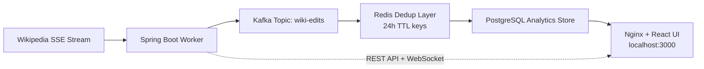

# WikiPulse: Real-Time Event Streaming & Analytics


WikiPulse is a production-style streaming analytics system that ingests live Wikipedia edit events, processes and enriches them in real time, and serves both live firehose updates and aggregate analytics through a modern dashboard.

## Architecture



## Core Features And The Why

### 1. High-Throughput Event Ingestion
- **What**: Reactive SSE ingestion from Wikipedia RecentChanges, continuously publishing events into Kafka.
- **The Why**: Traffic arrives in unpredictable bursts. A direct producer-to-database path risks overload, dropped writes, and backpressure failures.
- **Engineering Outcome**: Smooth, resilient ingestion with asynchronous decoupling between producers and consumers.

### 2. Kafka As The Shock-Absorber
- **What**: Partitioned Kafka topic (`wiki-edits`) with consumer-group based processing.
- **The Why**: Real-time edit rates spike non-linearly. Kafka absorbs burst load, preserves ordered partition streams, and enables controlled downstream consumption.
- **Engineering Outcome**: Stable throughput under spikes, safer retries, and scalable worker parallelism.

### 3. Redis For Distributed 24-Hour Exact-Once Deduplication
- **What**: Redis-backed dedup keys with 24-hour TTL.
- **The Why**: In distributed consumers, duplicate delivery can happen due to retries, rebalances, or transient failures. Stateless dedup is not enough across replicas.
- **Engineering Outcome**: Distributed idempotency across workers without expensive cross-node coordination.

### 4. PostgreSQL As The Durable Analytics Source Of Truth
- **What**: Persisted enriched edit records and aggregate-friendly query model.
- **The Why**: Dashboards need consistent historical analytics, not just ephemeral stream snapshots.
- **Engineering Outcome**: Reliable data retention for trend analysis and API-driven aggregate computation.

### 5. Nginx Reverse Proxy For A Seamless Frontend
- **What**: Nginx serves React static assets and proxies `/api` and `/ws-wikipulse` to Spring Boot.
- **The Why**: Browser CORS boundaries and mixed-origin websocket traffic complicate local deployments.
- **Engineering Outcome**: Single-origin UX on `localhost:3000`, frictionless local startup, and simpler operational topology.

## Technical Achievements

- Java 21 + Spring Boot 3.4 runtime with containerized deployment.
- Health-gated startup sequencing for ZooKeeper, Kafka, Redis, and PostgreSQL.
- End-to-end stream pipeline: ingestion, deduplication, persistence, analytics APIs, and live websocket updates.
- Production-style observability surface via actuator metrics and dashboard-ready architecture.
- Kubernetes manifests with HPA policy for distributed scaling.

## Quick Start (Docker)

### Prerequisites
- Docker Desktop (or Docker Engine with Compose v2)
- Git

### One-Click Startup

```bash
git clone https://github.com/DMJain/WikiPulse.git
cd WikiPulse
docker compose up -d --build
```

### Verify Containers

```bash
docker compose ps
```

### Access Points

- UI entry point: **http://localhost:3000**
- API proxy example: **http://localhost:3000/api/edits/recent?limit=5**
- WebSocket/SockJS probe: **http://localhost:3000/ws-wikipulse/info?t=1**

### Shutdown

```bash
docker compose down
```

## Advanced Start (Kubernetes)

For distributed deployment, autoscaling, and cluster-native operations, Kubernetes manifests are available in **`/k8s`**.

- Includes infrastructure and app deployment manifests.
- Includes HPA configuration for dynamic worker scaling.
- Includes observability resources for Grafana and Prometheus.

Example:

```bash
kubectl apply -f k8s/
```

## Repository Highlights

- `src/main/java`: Spring Boot producer and worker services.
- `frontend`: React dashboard, websocket client, and analytics UI.
- `k8s`: Kubernetes manifests for infra, app, HPA, and observability.
- `grafana`: Prebuilt dashboard JSON.
- `logs`: Architecture decisions and system execution records.

## License

This repository is maintained as an engineering portfolio and learning artifact. Review repository policy before external redistribution.
