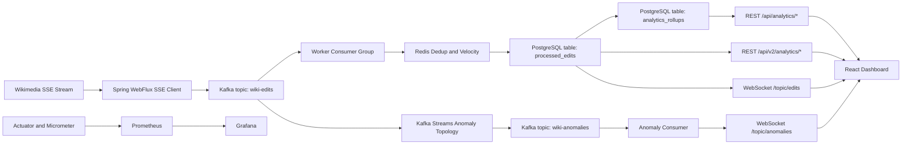

# WikiPulse V3: Streaming Architecture Trade-off Exploration

[](https://openjdk.org/)
[](https://spring.io/projects/spring-boot)
[](https://kafka.apache.org/)
[](https://kafka.apache.org/documentation/streams/)
[](https://www.postgresql.org/)
[](https://redis.io/)
[](https://react.dev/)
[](https://prometheus.io/)
[](https://grafana.com/)
[](https://kubernetes.io/)
[](https://docs.docker.com/compose/)

WikiPulse V3 is a pragmatic exploration of real-time streaming system behavior under simulated load.

This repository centers on:

1. streaming pipeline exploration
2. backpressure and consumer scaling behavior
3. PostgreSQL serving both OLTP and analytical endpoints through targeted indexing and materialized-view style rollups

The reliability posture is loss-minimized, at-least-once processing, not absolute delivery guarantees.

Architecture walkthrough placeholder:

- Full walkthrough and scaling demo: `INSERT_LINK_LATER`

---

## Table of Contents

1. [What This Project Explores](#what-this-project-explores)
2. [System Architecture Deep Dive](#system-architecture-deep-dive)
3. [Reliability Model](#reliability-model)
4. [React Dashboard](#react-dashboard)
5. [Observability Stack](#observability-stack)
6. [Local Docker Fast-Start](#local-docker-fast-start)
7. [Kubernetes Deployment and Live Demo](#kubernetes-deployment-and-live-demo)
8. [Testing Methodology](#testing-methodology)
9. [Roadmap](#roadmap)

---

## What This Project Explores

Wikimedia `recentchange` is bursty by nature. Traffic can spike quickly, and stream systems need to absorb those bursts without stalling consumers or collapsing write latency.

WikiPulse is intentionally built to explore those trade-offs:

1. Kafka buffering and partition-level backpressure behavior
2. Manual-ack consumer flow with deduplication and dead-letter safety
3. PostgreSQL dual role:
   1. durable write path for processed edits
   2. analytical serving path for `/api/analytics/*` and `/api/v2/analytics/*`
4. React + WebSocket user experience under continuous inbound traffic

---

## System Architecture Deep Dive

### End-to-end flow

1. `WikipediaSseClient` consumes Wikimedia SSE and publishes normalized `WikiEditEvent` records to Kafka (`wiki-edits`).
2. `WikiEditConsumer` processes records with manual acknowledgments.
3. Redis handles:
   1. dedup lock (`edit:processed:<id>`, 24h TTL)
   2. velocity signal (`bot:velocity:<user>`, 60s TTL)
4. `ProcessedEditService` persists records to PostgreSQL and broadcasts live updates.
5. `AnalyticsAggregationService` rolls recent windows into `analytics_rollups` for fast grouped reads.
6. Analytics APIs read from PostgreSQL:
   1. rollup-driven endpoints (`/api/analytics/*`)
   2. indexed direct queries for deep analytics (`/api/v2/analytics/*`)
7. Kafka Streams anomaly topology emits `wiki-anomalies`, which the UI receives through `/topic/anomalies`.

### Architecture diagram



### Why PostgreSQL is doing both jobs

PostgreSQL currently handles transactional writes and analytics reads by combining:

1. write-optimized event persistence in `processed_edits`
2. targeted indexes for filter-heavy analytical endpoints
3. materialized-view style rollups (`analytics_rollups`) refreshed on a schedule

---

## Reliability Model

The worker follows a save-before-ack contract:

1. Read from Kafka
2. Validate and deduplicate
3. Enrich (complexity and bot velocity)
4. Persist to PostgreSQL
5. Publish WebSocket update
6. Acknowledge Kafka offset

This yields loss-minimized, at-least-once processing semantics with replay tolerance.

Malformed payloads are isolated through retry plus dead-letter routing (`wiki-edits-dlt`) instead of freezing partitions.

---

## React Dashboard

The frontend is split into two operator views:

1. `AnalyticsOverviewTab`
   1. KPI snapshots, language/namespace/bot distributions, trend chart
   2. Poll-driven reads from `/api/analytics/*` and `/api/v2/analytics/*`
   3. Live anomaly ticker from `/topic/anomalies`
2. `LiveFirehoseTab`
   1. Initial hydration from `/api/edits/recent`
   2. Continuous stream updates from `/topic/edits`
   3. Fixed-size rolling window to cap memory/render overhead

---

## Observability Stack

Telemetry path:

1. Spring Actuator exposes `/actuator/prometheus`
2. Prometheus scrapes worker + container telemetry
3. Grafana visualizes throughput, lag, CPU, memory, and service health

Representative metrics:

1. `wikipulse_edits_processed_total`
2. `wikipulse_bots_detected_total`
3. `wikipulse_errors_total`
4. `wikipulse_processing_latency`
5. `kafka_consumer_fetch_manager_records_lag`

---

## Local Docker Fast-Start

### Prerequisites

1. Docker Desktop with Compose v2
2. Recommended minimum 8 GB RAM
3. Ports available: `3000`, `3001`, `5432`, `6379`, `8080`, `9090`, `9092`

### Start

```bash
docker compose up -d --build
```

### Verify

```bash
docker compose ps
curl http://localhost:8080/actuator/health
```

### Access

1. React Dashboard: `http://localhost:3000`
2. Grafana: `http://localhost:3001`
3. Prometheus: `http://localhost:9090`
4. Worker metrics: `http://localhost:8080/actuator/prometheus`

### Stop

```bash
docker compose down
```

---

## Kubernetes Deployment and Live Demo

### 1) Start Minikube and metrics server

```bash
minikube start --cpus=4 --memory=8192
minikube addons enable metrics-server
```

### 2) Build images inside Minikube daemon (PowerShell)

```powershell
minikube -p minikube docker-env --shell powershell | Invoke-Expression
docker build -t wikipulse-ingestor:latest .
docker build -t wikipulse-frontend:latest ./frontend
```

### 3) Deploy

```bash
kubectl apply -f k8s/infrastructure.yaml
kubectl apply -f k8s/configmap.yaml
kubectl apply -f k8s/secret.yaml
kubectl apply -f k8s/deployment.yaml
kubectl apply -f k8s/service.yaml
kubectl apply -f k8s/frontend-deployment.yaml
kubectl apply -f k8s/hpa.yaml
```

### 4) Wait for rollout

```bash
kubectl rollout status deployment/wikipulse-worker
```

### 5) Validate baseline

```bash
kubectl get pods -o wide
kubectl get hpa wikipulse-worker-hpa
kubectl top pods -l app=wikipulse-worker
```

### 6) Open UI

```bash
minikube service wikipulse-frontend
```

### 7) Optional load test for autoscaling behavior

```bash
bash scripts/k8s_load_test.sh
```

Watchers:

```bash
kubectl get hpa wikipulse-worker-hpa -w
kubectl get pods -l app=wikipulse-worker -w
kubectl describe hpa wikipulse-worker-hpa
```

### 8) Cleanup

```bash
kubectl delete -f k8s/hpa.yaml --ignore-not-found
kubectl delete -f k8s/frontend-deployment.yaml --ignore-not-found
kubectl delete -f k8s/service.yaml --ignore-not-found
kubectl delete -f k8s/deployment.yaml --ignore-not-found
kubectl delete -f k8s/secret.yaml --ignore-not-found
kubectl delete -f k8s/configmap.yaml --ignore-not-found
kubectl delete -f k8s/infrastructure.yaml --ignore-not-found
minikube stop
```

---

## Testing Methodology

Testing focuses on behavior under realistic infrastructure, not mocked-only happy paths.

1. Unit tests for deterministic utility and rule logic
2. Integration tests with Testcontainers for Kafka, PostgreSQL, and Redis
3. API and metrics assertions for end-to-end confidence

Run:

```powershell
.\mvnw clean compile
.\mvnw test
```

---

## Roadmap

1. Add schema governance and evolution checks for event contracts
2. Expand anomaly rules with multi-window baselines and confidence scoring
3. Add deterministic replay/load harness for repeatable scaling experiments
4. Package Kubernetes deployment as Helm chart overlays

---

## Closing

WikiPulse V3 is a working sandbox for streaming architecture trade-offs, not a claim of perfect reliability. It is designed to make operational behavior visible: queue pressure, consumer lag, scaling response, and analytics query cost.

For full architecture rationale and explicit trade-off notes, see `ARCHITECTURE.md`.

